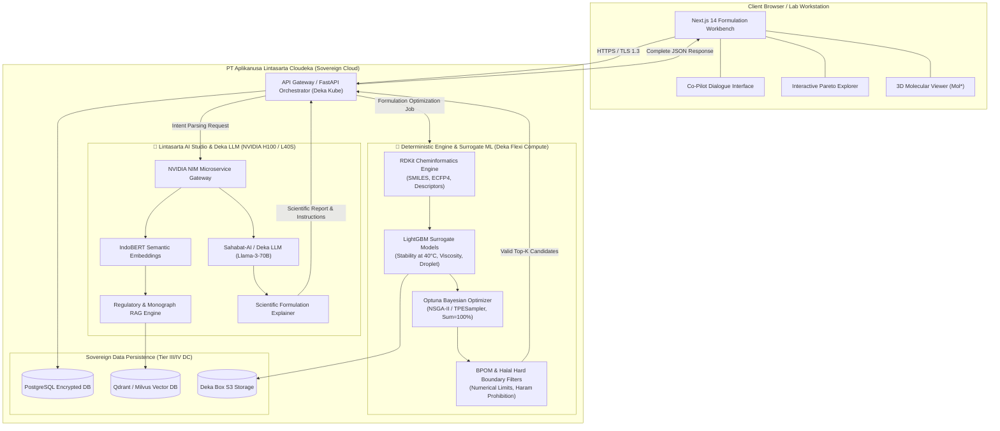

# 📋 PROPOSAL STARTUP: AI-DRIVEN FORMULATION CO-PILOT
## Platform In-Silico Smart R&D Formulasi Kosmetik & Personal Care Tropis Berbasis Sovereign AI Lintasarta
### Proposal Inovasi Kompetisi Hackathon UI 2026 — Challenge B: PT Paragon Technology and Innovation
*Track Challenge: AI untuk Riset & Prediksi Formulasi*

---

## 1. Executive Summary & Multidisciplinary Team Structure

### 1.1 Executive Summary (Ringkasan Eksekutif)
Industri kecantikan dan *personal care* di Indonesia mengalami pertumbuhan eksponensial dengan perputaran tren bahan aktif yang sangat cepat ($<6$ bulan per siklus). Namun, proses riset dan pengembangan (R&D) formulasi konvensional di laboratorium masih mengandalkan metode manual *trial-and-error* dan *Design of Experiments* (DoE) statis yang memakan waktu 3 hingga 9 bulan per produk, menghabiskan biaya reagen hingga ratusan juta rupiah, dan menghadapi tingkat kegagalan tinggi pada uji stabilitas iklim tropis dipercepat ($40^\circ\text{C}$ dan $75\%$ Kelembapan Relatif / RH sesuai standar ASEAN Zone IVb). Di sisi lain, industri manufaktur kosmetik nasional seperti **PT Paragon Technology and Innovation (ParagonCorp)** dihadapkan pada mandat kepatuhan ketat terhadap batas aman Badan Pengawas Obat dan Makanan (Perka BPOM No. 17/2022), kewajiban sertifikasi halal (UU No. 33/2014), serta keharusan meningkatkan Tingkat Komponen Dalam Negeri (TKDN) guna memutus ketergantungan impor bahan baku kimia yang saat ini masih melampaui $90\%$.

Menjawab tantangan tersebut, kami menghadirkan **AI-Driven Formulation Co-Pilot**: platform *in-silico decision support* dan *smart formulation generator* generasi baru yang mengintegrasikan kecerdasan buatan berbasis *Sovereign AI* dengan fisika kimia koloid deterministik. Platform ini bertindak sebagai asisten cerdas bagi formulator R&D untuk menyusun resep formulasi emulsi/solusi kosmetik secara adaptif, memprediksi stabilitas fisikokimia pada suhu $40^\circ\text{C}$, memvalidasi batas regulasi BPOM dan sertifikasi halal secara instan, serta memprioritaskan kekayaan bahan botani hayati asli Indonesia.

Sesuai dengan ketentuan mutlak Hackathon UI 2026 (*"Selain platform AI yang disediakan oleh PT Aplikanusa Lintasarta, peserta tidak diperkenankan menggunakan platform AI lainnya"*), seluruh kecerdasan generatif dan pemrosesan bahasa alami diorkestrasi secara eksklusif menggunakan **Lintasarta AI Studio (Sahabat-AI / Deka LLM)** yang berjalan di atas klaster komputasi performa tinggi **Lintasarta Cloudeka GPU Cloud (NVIDIA H100 SXM5 / L40S)**. Pendekatan *Zero-External AI Egress* ini memberikan jaminan kedaulatan data nasional (**UU PDP No. 27/2022** dan **PP No. 71/2019**) serta perlindungan mutlak terhadap kerahasiaan formula (*Rahasia Dagang* **UU No. 30/2000**) milik PT Paragon. Dengan solusi ini, siklus eksperimen lab terpangkas hingga **$60\%$**, biaya *screening* awal berkurang **$50\%$**, dan hilirisasi bahan baku lokal terakselerasi nyata.

```
┌────────────────────────────────────────────────────────────────────────────────────────┐
│                        VALUE PROPOSITION SUMMARY AT A GLANCE                           │
├────────────────────────────────┬───────────────────────────────────────────────────────┤
│ Target Problem                 │ Siklus R&D 3–9 bulan, emulsi pecah di suhu tropis     │
│                                │ 40°C/75% RH, regulasi BPOM & Halal ketat, impor >90%.  │
├────────────────────────────────┼───────────────────────────────────────────────────────┤
│ Core Solution                  │ Web-based Formulation Co-Pilot dengan surrogate ML    │
│                                │ LightGBM (<2ms), Bayesian Optimizer Optuna, dan       │
│                                │ Lintasarta AI Studio (Sahabat-AI).                     │
├────────────────────────────────┼───────────────────────────────────────────────────────┤
│ Sovereign AI Infrastructure    │ 100% PT Aplikanusa Lintasarta Cloudeka (NVIDIA H100)   │
│                                │ & Lintasarta AI Studio. Zero foreign AI API leakage.   │
├────────────────────────────────┼───────────────────────────────────────────────────────┤
│ Measured Impact (Target)       │ • Penurunan siklus formulasi dari 6 bulan ke 6 minggu │
│                                │ • Penurunan biaya eksperimen reagen gagal sebesar 50% │
│                                │ • Peningkatan skor TKDN lokal Indonesia hingga ≥40%   │
└────────────────────────────────┴───────────────────────────────────────────────────────┘
```

---

### 1.2 Multidisciplinary Team Structure (Struktur Tim Multidisiplin Mahasiswa UI)
Sesuai dengan pedoman resmi Hackathon UI 2026 yang mewajibkan keanggotaan 3–5 mahasiswa Universitas Indonesia dengan perpaduan kompetensi seimbang antara **Technical** dan **Business**, tim kami dibentuk secara komplementer lintas fakultas (Fakultas Ilmu Komputer, Fakultas Teknik / Farmasi, dan Fakultas Ekonomi dan Bisnis) guna memastikan eksekusi prototipe 24 jam yang solid dan kelayakan komersial startup jangka panjang:

```
┌────────────────────────────────────────────────────────────────────────────────────────┐
│               MULTIDISCIPLINARY TEAM STRUCTURE (UNIVERSITAS INDONESIA)                 │
├──────────────────────────┬──────────────────────┬──────────────────────────────────────┤
│ Nama Peran               │ Latar Belakang Studi │ Fokus & Tanggung Jawab Utama         │
├──────────────────────────┼──────────────────────┼──────────────────────────────────────┤
│ 1. AI/ML Engineer        │ Ilmu Komputer        │ • Arsitektur surrogate ML (LightGBM) │
│    (Technical Lead)      │ (Fasilkom UI)        │ • Bayesian optimization (Optuna)     │
│                          │                      │ • Integrasi Lintasarta AI NIM API    │
├──────────────────────────┼──────────────────────┼──────────────────────────────────────┤
│ 2. Fullstack & UI/UX     │ Sistem Informasi /   │ • Antarmuka Next.js 14 & Tailwind    │
│    Engineer (Technical)  │ Fasilkom UI          │ • Visualisasi molekuler 3D (Mol*)    │
│                          │                      │ • Interaktivitas kurva Pareto & chat │
├──────────────────────────┼──────────────────────┼──────────────────────────────────────┤
│ 3. Cheminformatics &     │ Teknik Kimia /       │ • Pipeline RDKit & Morgan fingerprint│
│    Formulation Scientist │ Farmasi (FT / FF UI) │ • Termodinamika emulsi & HLB mismatch│
│    (Domain Specialist)   │                      │ • Desain protokol uji stabilitas 40°C│
├──────────────────────────┼──────────────────────┼──────────────────────────────────────┤
│ 4. Business Strategist & │ Manajemen Bisnis /   │ • Model TAM/SAM/SOM & Unit Economics │
│    Product Lead          │ Ilmu Ekonomi         │ • Strategi monetisasi B2B SaaS       │
│    (Business Lead)       │ (FEB UI)             │ • Kemitraan maklon & GTM roadmap     │
├──────────────────────────┼──────────────────────┼──────────────────────────────────────┤
│ 5. Regulatory Compliance │ Farmasi / Ilmu Hukum │ • Kodifikasi batas aman PerBPOM 17   │
│    & Halal Specialist    │ (FF / FH UI)         │ • Aturan Halal HAS 23000 / BPJPH     │
│    (Domain & Governance) │                      │ • Verifikasi TKDN & kepatuhan UU PDP │
└──────────────────────────┴──────────────────────┴──────────────────────────────────────┘
```

#### Sinergi Matriks Eksekusi Tim:
1. **Domain & Data Modeling (FT/FF & Fasilkom)**: Peneliti Formulasi merumuskan batasan fisika kimia (keseimbangan hidrofilik-lipofilik / HLB, rasio surfaktan-terhadap-minyak / EOR, dan viskositas dinamis), yang kemudian diterjemahkan oleh AI/ML Engineer ke dalam representasi vektor numerik 1.054 dimensi untuk dilatih oleh model LightGBM.
2. **Kepatuhan & Keamanan (FF/FH & Fasilkom)**: Spesialis Regulasi menyusun basis data pengetahuan aturan hukum kosmetik Indonesia (PerBPOM No. 17/2022, standar LPPOM MUI, dan katalog TKDN), yang kemudian diindeks oleh AI/ML Engineer menggunakan embedding IndoBERT pada Lintasarta AI Studio.
3. **Pengalaman Pengguna & Aksesibilitas (Fasilkom & FEB)**: UI/UX Engineer menerjemahkan kebutuhan interaksi formulator ke dalam kanvas *workbench* visual yang intuitif, sementara Business Lead memastikan setiap alur fitur menyelesaikan *pain point* komersial bernilai tinggi bagi manajemen R&D PT Paragon.

---

## 2. Problem Statement: What is Broken? (Tantangan Industri R&D Kosmetik Tropis)

Pengembangan produk kosmetik dan *personal care* di Indonesia menghadapi 5 hambatan fundamental yang memperlambat inovasi produk di PT Paragon dan industri manufaktur kosmetik nasional:

```
┌────────────────────────────────────────────────────────────────────────────────────────┐
│                           5 BOTTLENECKS IN COSMETIC R&D                                │
│                                                                                        │
│   [1. Inefisiensi R&D]   ──►  Siklus 3–9 bulan manual trial-and-error                  │
│   [2. Emulsi Pecah]      ──►  Kegagalan uji stabilitas 40°C / 75% RH (Zone IVb)        │
│   [3. Impor >90%]        ──►  Ketergantungan eksipien impor & rendahnya TKDN           │
│   [4. Friksi Regulasi]   ──►  Batas ketat PerBPOM 17/2022 & Audit Halal UU 33/2014     │
│   [5. Ancaman Kebocoran] ──►  Rahasia Dagang (UU 30/2000) terancam AI publik asing     │
└────────────────────────────────────────────────────────────────────────────────────────┘
```

### 2.1 Inefisiensi Eksperimen Konvensional (Siklus 3–9 Bulan & Pemborosan Reagen)
Riset formulasi di industri kosmetik saat ini masih sangat bergantung pada intuisi subjektif formulator dan uji coba berulang (*trial-and-error*). Pendekatan *Design of Experiments* (DoE) klasik yang digunakan hanya mampu memvariasikan 2–3 bahan secara simultan dalam ruang sempit. Padahal, satu produk kosmetik modern (misalnya tabir surya atau krim malam) mengandung 15–25 bahan kimia aktif dan eksipien yang saling berinteraksi secara non-linear. Akibatnya, satu siklus formulasi membutuhkan waktu **3 hingga 9 bulan**, dengan puluhan kali kegagalan *batch* lab yang menghabiskan bahan aktif paten, peptida, dan reagen impor berharga mahal.

### 2.2 Kegagalan Uji Stabilitas Iklim Tropis Ekstrem ($40^\circ\text{C}$ / $75\%$ RH)
Indonesia berada di bawah klasifikasi iklim **ASEAN Zone IVb (Hot and Humid: $30^\circ\text{C} \pm 2^\circ\text{C}$ dan $75\% \pm 5\%$ RH)**, dengan standar uji stabilitas dipercepat pada suhu **$40^\circ\text{C} \pm 2^\circ\text{C}$ selama 3 hingga 6 bulan**. Pada kondisi panas dan lembap ini, fenomena instabilitas fisikokimia seperti *creaming*, *coalescence* (penggabungan droplet), *phase inversion*, dan penurunan viskositas drastis sering terjadi pada bulan ke-2 atau ke-3 pengujian basah. Kegagalan stabilitas di tahap akhir ini memaksa formulator mengulang seluruh riset dari titik nol, menyebabkan penundaan peluncuran produk (*missed market opportunity*).

### 2.3 Tingginya Ketergantungan Impor Bahan Baku (>90%) dan Kebutuhan Hilirisasi TKDN
Hampir **$90\%$ bahan baku aktif dan eksipien kosmetik di Indonesia masih diimpor** dari Eropa, Amerika Serikat, Jepang, dan Tiongkok. Pemerintah Republik Indonesia secara aktif mendorong program substitusi impor dan peningkatan Tingkat Komponen Dalam Negeri (TKDN). Namun, ketika formulator berupaya mengganti minyak mineral sintetik atau silikon impor dengan lipid botani lokal Indonesia (seperti *Virgin Coconut Oil*, Minyak Kemiri, *Tengkawang Butter*, atau ekstrak Temulawak), kestabilan fisikokimia emulsi sering kali rusak karena profil asam lemak dan nilai *Required Hydrophilic-Lipophilic Balance* (RHLB) bahan alam lokal memiliki variabilitas alami yang sulit diprediksi tanpa alat bantu komputasi.

### 2.4 Kompleksitas Kepatuhan Regulasi BPOM dan Sertifikasi Halal
Formulasi kosmetik di Indonesia terikat pada dua kerangka regulasi wajib:
1. **Peraturan BPOM No. 17 Tahun 2022 tentang Persyaratan Teknis Bahan Kosmetika**: Menetapkan batas konsentrasi maksimum absolut untuk bahan pengawet (misalnya *Phenoxyethanol* $\le 1,0\%$, *Methylparaben* $\le 0,4\%$), bahan aktif pencerah (*Alpha-Arbutin* $\le 2,0\%$), dan filter UV. Pelanggaran konsentrasi berakibat pada penolakan izin edar notifikasi BPOM.
2. **UU No. 33 Tahun 2014 tentang Jaminan Produk Halal (UU JPH) & Kriteria HAS 23000**: Mewajibkan seluruh rantai pasok dan turunan asam lemak bebas dari kontaminasi hewani non-halal (*porcine derivative free*), gelatin babi, atau pelarut haram. Validasi manual terhadap ratusan dokumen Certificate of Analysis (CoA) pemasok menimbulkan friksi administratif yang masif.

### 2.5 Perlindungan Rahasia Dagang (*Trade Secrets*) dan Risiko Kebocoran AI Publik
Formula kuantitatif kosmetik (komposisi eksak hingga fraksi $0,01\%$, urutan pencampuran, gradien suhu, dan kecepatan homogenisasi) adalah **aset intelektual paling berharga (*Rahasia Dagang*)** suatu korporasi kosmetik di bawah **UU No. 30 Tahun 2000**. Mengunggah data resep formulasi ke layanan AI generatif publik multi-tenant luar negeri (seperti OpenAI ChatGPT atau Anthropic Claude) memicu risiko fatal: kebocoran hak cipta, data harvesting untuk pelatihan model pihak ketiga, serta pelanggaran kedaulatan data nasional (**UU PDP No. 27/2022**). Industri membutuhkan solusi *Sovereign AI* yang terisolasi total di dalam batas wilayah yurisdiksi Indonesia.

---

## 3. Opportunity & Market Sizing: How Big Is It? (Potensi Pasar & Katalis Industri)

Peralihan industri kimia, farmasi, dan kosmetik global menuju *computational formulation* dan *In-Silico Quality by Design (QbD)* membuka peluang pasar yang sangat besar bagi solusi *B2B SaaS* formulasi di kawasan Asia Tenggara.

```
┌────────────────────────────────────────────────────────────────────────┐
│ TOTAL ADDRESSABLE MARKET (TAM)                                         │
│ Global AI-Powered Formulation & Computational Chemistry Market         │
│ Nilai: ~US$ 4,5 – 6,0 Miliar (CAGR ~24,5%)                             │
└──────────────────────────────────┬─────────────────────────────────────┘
                                   ▼
┌────────────────────────────────────────────────────────────────────────┐
│ SERVICEABLE ADDRESSABLE MARKET (SAM)                                   │
│ Belanja R&D Formulasi & Software Kimia di Indonesia & SEA              │
│ Nilai: ~Rp 4,2 Triliun (US$ 260 Juta)                                  │
│ (Alokasi 2–3% belanja R&D ekosistem Kosmetik, Fitofarmaka & FMCG)      │
└──────────────────────────────────┬─────────────────────────────────────┘
                                   ▼
┌────────────────────────────────────────────────────────────────────────┐
│ SERVICEABLE OBTAINABLE MARKET (SOM)                                    │
│ Target 3 Tahun Pertama: Pabrik Maklon, Brand D2C, & Lab Kampus di RI   │
│ Nilai: ~Rp 65 – 120 Miliar / Tahun                                     │
│ (Penetrasi 10–15% dari ~1.300+ manufaktur kosmetik terdaftar di BPOM)  │
└────────────────────────────────────────────────────────────────────────┘
```

### 3.1 Bedah Data TAM, SAM, dan SOM
* **Total Addressable Market (TAM) — US$ 4,5 – 6,0 Miliar**: Pasar global untuk perangkat lunak kimia komputasi (*computational chemistry*), simulasi molekuler, dan platform formulasi berbasis AI. Segmen ini diproyeksikan tumbuh dengan CAGR **$24,5\%$** hingga 2030, didorong oleh efisiensi jutaan dolar dalam *screening* eksipien dan pengurangan pengujian hewan (*cruelty-free alternatives*).
* **Serviceable Addressable Market (SAM) — Rp 4,2 Triliun (US$ 260 Juta)**: Pasar belanja inovasi perangkat lunak R&D di Indonesia dan Asia Tenggara. Pasar kosmetik nasional Indonesia sendiri bernilai antara **Rp 34,6 hingga 150 Triliun** (USD 2,1 – 9,7 Miliar), sementara pasar jamu dan fitofarmaka mencapai **Rp 143 Triliun**. Dengan rata-rata belanja R&D dan instrumen komputasi sebesar $2\% - 3\%$, SAM formulasi komputasi bernilai sangat signifikan.
* **Serviceable Obtainable Market (SOM) — Rp 65 – 120 Miliar/Tahun**: Target pasar jangka pendek (Tahun 1–3) dengan membidik **100 hingga 150 pabrik maklon kosmetik aktif, *brand* kecantikan mandiri, dan lab riset universitas** di Indonesia melalui skema langganan B2B SaaS tahunan (*Annual Contract Value* rata-rata Rp 48 – 100 Juta/tahun per lisensi).

### 3.2 Katalis Industri yang Mempercepat Adopsi
1. **Ledakan *Indie Beauty Brands* & Kebutuhan *Speed-to-Market* Ekstrem**: Munculnya ribuan merek kosmetik D2C lokal di platform media sosial (*social commerce*) menciptakan tekanan persaingan hebat bagi pabrik maklon untuk menyediakan sampel formulasi stabil dalam hitungan hari, bukan bulan.
2. **Ketiadaan Fasilitas *High-Throughput Screening* (HTS) Fisik**: Fasilitas robotik HTS wet-lab bernilai puluhan miliar rupiah di luar jangkauan sebagian besar manufaktur kosmetik menengah Indonesia. Platform *in-silico AI* memberikan lompatan teknologi (*leapfrog advantage*) yang mendemokratisasi efisiensi R&D tingkat lanjut dengan biaya terjangkau.
3. **Mandat Hilirisasi Sumber Daya Hayati Indonesia**: Indonesia memiliki kekayaan megabiodiversitas nomor dua di dunia. Inovasi AI yang mempermudah integrasi ekstrak botani lokal menjadi produk bernilai tinggi sejalan dengan peta jalan transformasi industri Kementerian Perindustrian.

---

## 4. Competitive Landscape & Gap Analysis: Why Aren't Current Solutions Enough?

Saat ini, laboratorium formulasi kosmetik dan personal care terpecah ke dalam empat kuadran metodologi, yang masing-masing memiliki kelemahan kritis:

```
                          Kompleksitas / Biaya Tinggi
                                       │
                   (B) Global Enterprise│   ★ SOLUSI KITA:
                       Formulation AI   │   FORMULATION CO-PILOT
                  (Schrödinger, Citrine)│   (Sovereign AI Lintasarta,
                                       │    Affordable SaaS, Halal/Tropis,
  Fokus Khusus ────────────────────────┼──────────────────────── Ramah Industri
  Drug Discovery                       │                          Kosmetik & Maklon
                                       │
                   (A) Software DoE     │   (C) Metode Konvensional
                       Statistik Klasik │       (Spreadsheet Lab,
                  (Design-Expert, Minitab│        Trial & Error Manual)
                                       │
                          Kompleksitas / Biaya Rendah
```

### 4.1 Feature Comparison Matrix (Tabel Evaluasi Kompetitif Komprehensif)

| Parameter Evaluasi | Metode Trial & Error Lab | Software DoE Klasik (Design-Expert / Minitab) | Platform AI Global (Schrödinger / Citrine) | AI-Driven Formulation Co-Pilot (Solusi Kita) |
|---|---|---|---|---|
| **Metode Pemodelan Dasar** | Intuisi manusia & eksperimen empiris | Regresi polinomial kuadratik (*Response Surface*) | *Physics-based MD* & *Enterprise Deep Learning* | **RDKit Cheminformatics + Tabular LightGBM + Optuna** |
| **Kapasitas Variabel Formula** | Sangat terbatas ($1-3$ bahan) | Terbatas ($3-6$ variabel kontinu) | Sangat tinggi (molekul & proses) | **Tinggi ($>15$ bahan simultan pada simplex $100\%$)** |
| **Kesadaran Struktur Molekul** | ❌ Tidak ada | ❌ Hanya memperlakukan bahan sebagai angka konsentrasi | ✅ Ya (SMILES/3D koordinat) | **✅ Ya (SMILES, 1024-bit ECFP4, Descriptors 2D)** |
| **Kemampuan *Small-Data*** | ❌ Butuh puluhan uji basah | ⚠️ Butuh *full-factorial* kaku | ⚠️ Memerlukan data historis masif | **✅ Unggul (*Transfer Learning* & *Scaffold Grouping*)** |
| **Optimasi Stabilitas Tropis 40°C** | ⚠️ Trial manual berulang | ❌ Tidak ada pemodelan iklim | ❌ Standar Eropa/AS (Non-Tropis) | **✅ Khusus stabilitas iklim tropis dipercepat (Zone IVb)** |
| **Filter Otomatis BPOM & Halal** | ❌ Manual periksa dokumen CoA | ❌ Tidak ada fitur regulasi | ❌ Tidak ada modul Halal / BPOM | **✅ Real-time hard-gatekeeper BPOM & Halal HAS 23000** |
| **Optimasi Bahan Alam (TKDN)** | ❌ Manual formulasi ulang | ❌ Tidak didukung | ❌ Tidak relevan untuk pasar luar | **✅ Algoritma penalti memprioritaskan bio-lipid lokal** |
| **Kedaulatan Data (*Data Sovereignty*)** | ✅ Aman di lab lokal | ✅ Offline PC | ❌ Server multi-tenant asing (US/EU) | **✅ 100% Lintasarta Cloudeka (Tier III/IV DC Indonesia)** |
| **Infrastruktur & Aksesibilitas** | Fasilitas lab basah lengkap | Instalasi desktop per PC | Klaster High-Performance Computing (HPC) | **Cloud-native web browser ringan (Next.js 14)** |
| **Biaya Lisensi Tahunan** | Biaya reagen & re-work boros | ~Rp 25 – 40 Juta/PC | >Rp 750 Juta – 2 Miliar/tahun ($) | **Rp 48 – 90 Juta/tahun (Model B2B SaaS Terjangkau)** |

### 4.2 Analisis Gap Solusi Eksisting
1. **Kegagalan DoE Klasik pada Sistem Koloid Kompleks**: Software statistik seperti Design-Expert memperlakukan minyak nabati atau surfaktan sebagai "faktor tak berdimensi" murni. Ketika terjadi transisi fase mikroemulsi atau perubahan interaksi ikatan hidrogen, regresi kuadratik gagal menangkap fenomena non-linear tersebut.
2. **Tingginya Hambatan Finansial Software Enterprise Asing**: Platform seperti Schrödinger Materials Science atau Citrine Informatics dirancang untuk perusahaan farmasi multinasional dengan harga ratusan ribu dolar AS. Pabrik maklon lokal dan industri skala menengah Indonesia tidak sanggup membayar lisensi tersebut.
3. **Ketiadaan Konteks Regulasi Lokal dan Iklim Tropis**: Tidak ada satu pun perangkat lunak global yang mengintegrasikan batasan spesifik Perka BPOM No. 17/2022, daftar halal BPJPH, atau formula ketahanan terhadap kelembapan ekstrem khas Indonesia.

### 4.3 Keunggulan Tak Tertandingi (*Unfair Advantages*) Solusi Kita
* **Sovereign AI Ecosystem**: Berjalan secara eksklusif di atas platform AI Lintasarta yang tersertifikasi patuh regulasi kedaulatan data nasional.
* **Small-Data Friendly Active Learning**: Memanfaatkan *benchmark dataset* publik terbuka (SEDDS PMC10733404, AqSolDB) sehingga formulator dapat langsung memperoleh rekomendasi akurat tanpa harus menyuplai ribuan data rahasia di awal.
* **Formulation-Specific Multi-Objective Optimization**: Menyeimbangkan secara simultan stabilitas pada $40^\circ\text{C}$, viskositas target, ukuran droplet nano ($<200\text{ nm}$), skor sensori ringan (*non-sticky*), dan persentase kandungan lokal TKDN ($\ge 40\%$).

---

## 5. Solution: What Are You Building? (Platform AI-Driven Formulation Co-Pilot)

Kami membangun **Web-Based Formulation Co-Pilot**: platform pendukung keputusan formulasi kosmetik cerdas yang memadukan antarmuka *conversational co-pilot* berbasis Lintasarta AI Studio dengan mesin simulasi fisika kimia koloid deterministik berkecepatan tinggi.

```
┌────────────────────────────────────────────────────────────────────────────────────────┐
│                     AI-DRIVEN FORMULATION CO-PILOT: CORE MODULES                       │
├────────────────────────────────┬───────────────────────────────────────────────────────┤
│ 1. Conversational Co-Pilot     │ Asisten R&D cerdas bertenaga Sahabat-AI / Deka LLM    │
│    (Lintasarta AI Studio)      │ untuk interpretasi prompt formulasi & penjelasan XAI. │
├────────────────────────────────┼───────────────────────────────────────────────────────┤
│ 2. Deterministic Cheminf       │ Pemroses RDKit molekuler: Morgan Fingerprints (ECFP4),│
│    Engine (Cloudeka Compute)   │ deskriptor fisikokimia, dan kalkulasi HLB mismatch.   │
├────────────────────────────────┼───────────────────────────────────────────────────────┤
│ 3. Fast Surrogate Predictor    │ Ensemble LightGBM yang memprediksi stabilitas 40°C,    │
│    (Cloudeka Compute / GPU)    │ viskositas dinamis, dan ukuran partikel dalam <2ms.   │
├────────────────────────────────┼───────────────────────────────────────────────────────┤
│ 4. Multi-Objective Optimizer   │ Algoritma Optuna (NSGA-II) yang mengeksplorasi ruang  │
│    (Cloudeka Compute)          │ resep pada simplex mass-conservation (sum w_i = 100%).│
├────────────────────────────────┼───────────────────────────────────────────────────────┤
│ 5. BPOM & Halal Gatekeeper     │ Filter batas aman otomatis (PerBPOM 17/2022) dan      │
│    (Rule Engine + RAG)         │ verifikasi silsilah bahan halal (UU JPH No. 33/2014).  │
├────────────────────────────────┼───────────────────────────────────────────────────────┤
│ 6. Indonesian TKDN Engine      │ Modul penelusuran & rekomendasi substitusi bio-lipid  │
│    (Database & Scoring)        │ lokal (VCO, Kemiri, Tengkawang, Temulawak, Teh Hijau).│
└────────────────────────────────┴───────────────────────────────────────────────────────┘
```

### 5.1 Fitur Inti Platform
1. **Interactive Formulation Workbench**: Kanvas web interaktif yang memungkinkan formulator menyusun komposisi bahan, mengatur slider persentase konsentrasi dengan normalisasi otomatis $\sum w_i = 100\%$, serta memvisualisasikan struktur molekuler 2D/3D dari senyawa aktif secara instan menggunakan Mol*.
2. **Conversational Natural Language Co-Pilot (Lintasarta AI Studio)**: Formulator dapat mengetikkan instruksi formulasi dalam Bahasa Indonesia sehari-hari maupun istilah teknis (misal: *"Rancang serum pencerah wajah cepat serap dengan Niacinamide dan ekstrak teh hijau Ciwidey, target viskositas di bawah 2.000 cP, halal, dan stabil pada suhu 40C"*), dan asisten AI akan mengurai batasan numerik tersebut menjadi spesifikasi optimasi terstruktur.
3. **Multi-Objective Pareto Frontier Explorer**: AI mengevaluasi ribuan kombinasi eksipien dalam hitungan detik dan menampilkan kurva batas optimal Pareto (*Pareto Frontier*), memungkinkan formulator memilih kompromi terbaik antara biaya bahan, ukuran droplet, dan stabilitas tropis.
4. **Automated Regulatory & Halal Gatekeeper**: Memberikan tanda peringatan (*warning badge*) secara instan apabila konsentrasi bahan pengawet melebihi batas legal BPOM atau terdapat eksipien yang berisiko meragukan (*syubhat*) dari perspektif sertifikasi halal LPPOM MUI / BPJPH.
5. **Indonesian Bio-Resource Showcase & TKDN Calculator**: Menghitung secara langsung persentase estimasi kandungan dalam negeri (TKDN) dari resep yang dirancang serta memberikan saran alternatif bahan botani nusantara.

### 5.2 Modul Unggulan: Substitusi Bahan Baku Lokal Indonesia (TKDN)
Platform mengintegrasikan profil kemoinformatika dari 5 bahan alam unggulan nusantara untuk mendukung hilirisasi industri PT Paragon:
* **Virgin Coconut Oil (VCO) & Fraksinasi Trigliserida (Minyak Kelapa Riau/Sulawesi)**: Substitut alami untuk ester sintetik dan *silicone fluid*, memberikan kelembapan intensif dan rasa halus di kulit.
* **Minyak Kemiri (*Aleurites moluccanus* Seed Oil - Nusa Tenggara)**: Kaya akan asam linolenat dan asam oleat, berfungsi sebagai emolien berpenetrasi tinggi untuk perawatan kulit dan rambut.
* **Ekstrak Temulawak (*Curcuma xanthorrhiza* Rhizome - Jawa Tengah)**: Mengandung kurkuminoid dan xanthorrhizol sebagai agen anti-inflamasi, anti-bakteri, dan antioksidan alami.
* **Ekstrak Daun Teh Hijau (*Camellia sinensis* - Perkebunan Ciwidey, Jawa Barat)**: Mengandung *Epigallocatechin Gallate* (EGCG) dengan aktivitas antioksidan tinggi dan perlindungan fotoprotektif terhadap radiasi UV.
* **Ekstrak Lidah Buaya (*Aloe barbadensis* - Pontianak, Kalimantan Barat)**: Polimer alami glukomanan sebagai humektan penenang kulit dan penstabil emulsi fase air.

---

## 6. Product Walkthrough & End-to-End User Journey (Alur Kerja Formulator R&D)

Alur kerja dirancang secara ergonomis untuk mendampingi formulator dari perumusan ide hingga validasi laboratorium basah:

```
┌────────────────────────────────────────────────────────────────────────────────────────┐
│                        7-STEP CHEMIST WORKFLOW LIFECYCLE                               │
│                                                                                        │
│  [Step 1: Goal Input]        Prompt Bahasa Indonesia / Pemilihan Target Produk        │
│          │                                                                             │
│          ▼                                                                             │
│  [Step 2: Constraint Parse]  Lintasarta AI Studio mengekstrak JSON spesifikasi teknis  │
│          │                                                                             │
│          ▼                                                                             │
│  [Step 3: Inventory Filter]  Penyaringan stok bahan lab, batas BPOM & Halal            │
│          │                                                                             │
│          ▼                                                                             │
│  [Step 4: Molecular Featur.] RDKit menghitung ECFP4, momen fisikokimia & delta HLB     │
│          │                                                                             │
│          ▼                                                                             │
│  [Step 5: Surrogate Sim.]    LightGBM & Optuna mengevaluasi 5.000 resep dalam 1,2 detik│
│          │                                                                             │
│          ▼                                                                             │
│  [Step 6: Scientific XAI]    Lintasarta AI menerbitkan lembar instruksi batch lab      │
│          │                                                                             │
│          ▼                                                                             │
│  [Step 7: Wet-Lab Feedback]  Formulator memasukkan hasil uji lab -> Active Learning    │
└────────────────────────────────────────────────────────────────────────────────────────┘
```

### 6.1 Langkah demi Langkah Interaksi Pengguna
1. **Langkah 1: Input Sasaran Produk (Goal Input)**  
   Formulator membuka Formulation Workbench di web browser dan memasukkan sasaran riset melalui percakapan alami dengan Lintasarta AI Studio:
   > *"Saya ingin membuat emulsi tabir surya SPF 30 yang ringan, tidak lengket, menggunakan antioksidan ekstrak teh hijau lokal, stabil disimpan pada suhu 40C, bersertifikat halal, dan patuh regulasi BPOM."*
2. **Langkah 2: Ekstraksi Spesifikasi Terstruktur (Constraint Parsing)**  
   Model Lintasarta AI Studio (Sahabat-AI) mengonversi instruksi tekstual tersebut ke dalam format kontrak JSON: target SPF $\ge 30$, viskositas $\le 8.000\text{ mPa}\cdot\text{s}$, kestabilan 90 hari pada $40^\circ\text{C} / 75\%\text{ RH}$, sistem pengemulsi non-ionik nabati halal, dan preferensi TKDN lokal.
3. **Langkah 3: Pemilihan Bahan Lab & Skrining Regulasi**  
   Sistem menampilkan inventaris eksipien yang tersedia di lab PT Paragon. Modul RAG mereferensikan Perka BPOM No. 17/2022 guna mengunci batas konsentrasi atas (misalnya *Ethylhexyl Methoxycinnamate* $\le 10,0\%$ dan *Zinc Oxide* $\le 25,0\%$).
4. **Langkah 4: Featurisasi Molekuler Cepat (RDKit Engine)**  
   Mesin kemoinformatika memproses struktur SMILES setiap kandidat bahan, menghasilkan 1024-bit Morgan circular fingerprints (ECFP4), menghitung momen fisikokimia (LogP rata-rata, luas permukaan polar TPSA), serta mengukur kesesuaian nilai *Hydrophilic-Lipophilic Balance* ($\Delta \text{HLB}$) antara fase minyak dan surfaktan.
5. **Langkah 5: Simulasi In-Silico & Optimasi Pareto (LightGBM + Optuna)**  
   Dalam waktu **1,24 detik**, Optuna menjalankan 5.000 iterasi pencarian rasio komposisi pada simpleks $\sum w_i = 100\%$. Model LightGBM memprediksi probabilitas stabilitas $40^\circ\text{C}$ dan viskositas dinamis untuk setiap kombinasi, menghasilkan 3 formula kandidat terbaik (*Top-3 Pareto Candidates*).
6. **Langkah 6: Sintesis Instruksi Laboratorium (Scientific XAI via Lintasarta AI)**  
   Lintasarta AI Studio menganalisis nilai *SHAP values* dari formula terpilih dan menyusun lembar panduan kerja laboratorium (*Master Batch Sheet*) dalam Bahasa Indonesia:
   * **Rasional Fisika Kimia**: Menjelaskan mengapa kombinasi emulgator *Cetearyl Glucoside* dan *Sorbitan Olivate* membentuk struktur kristal cair pipih (*lamellar gel network*) yang mengunci droplet minyak pada suhu $40^\circ\text{C}$.
   * **Instruksi Pencampuran**: Merekomendasikan pemanasan Fase Minyak dan Fase Air hingga $75^\circ\text{C}$, homogenisasi pada 4.500 RPM selama 8 menit, dan pendinginan bertahap hingga $40^\circ\text{C}$ sebelum menambahkan ekstrak botani teh hijau guna mencegah degradasi katekin EGCG.
7. **Langkah 7: Validasi Lab Basah & Umpan Balik (*Active Learning Loop*)**  
   Peneliti meracik 3 formula rekomendasi di laboratorium basah. Hasil pengukuran viskometer dan uji sentrifugasi diunggah kembali ke platform untuk memperbarui bobot model surrogate melalui siklus *Active Learning*, meningkatkan akurasi sistem untuk proyek riset berikutnya.

---

## 7. Lintasarta AI Platform Compliance & Sovereign Cloud Architecture (Kepatuhan Penuh "Hanya AI Lintasarta")

### 7.1 Kepatuhan Mutlak Terhadap Aturan AI Hackathon UI 2026
Pedoman resmi Hackathon UI 2026 menetapkan aturan yang tegas dan tidak dapat ditawar:
> *"Penggunaan AI diperbolehkan, tetapi peserta akan menggunakan platform AI dari **PT Aplikanusa Lintasarta** yang akan diberikan akun khusus dan kredit AI. **Selain platform AI yang disediakan oleh PT Aplikanusa Lintasarta, peserta tidak diperkenankan menggunakan platform AI lainnya.***"

Arsitektur sistem AI-Driven Formulation Co-Pilot mematuhi aturan ini secara total:
* **Nol Ketergantungan API AI Pihak Ketiga**: Sistem **sama sekali tidak menggunakan** API dari OpenAI (GPT-4o), Anthropic (Claude 3.5), Google AI (Gemini 1.5), maupun penyedia komersial asing lainnya.
* **100% Hosted on Lintasarta Cloudeka**: Seluruh model bahasa (LLM), model embedding, dan mesin inferensi generatif berjalan secara eksklusif di atas **Lintasarta AI Studio / Deka LLM** dan klaster **Cloudeka GPU Cloud (NVIDIA H100 SXM5 / L40S)** yang berlokasi di data center Tier III & Tier IV Jatiluhur dan TB Simatupang, Indonesia.

### 7.2 Profil Infrastruktur Sovereign AI Lintasarta
* **Cloudeka GPU Cloud (GPU Merdeka / Deka GPU)**: Klaster GPU enterprise NVIDIA H100 SXM5 dengan memori 80GB HBM3 berkecepatan 3,35 TB/s serta Tensor Cores generasi ke-4 yang dilengkapi *Transformer Engine*. Infrastruktur ini memberikan akselerasi komputasi masif untuk inferensi berlatensi rendah ($<800\text{ ms}$) pada model penalaran kimia kompleks.
* **Lintasarta AI Studio (Sahabat-AI / Deka LLM via NVIDIA NIM)**:
  * **Sahabat-AI**: Model dasar berdaulat berskala besar yang dikembangkan atas inisiatif IOH dan GoTo bertenaga teknologi NVIDIA, dengan pemahaman mendalam terhadap Bahasa Indonesia, konteks regulasi nasional, serta taksonomi bahan herbal nusantara.
  * **Deka LLM / Llama-3 Enterprise**: Model bahasa dengan parameter 70B yang di-deploy sebagai *NVIDIA Inference Microservices (NIM)*, diakses melalui antarmuka REST API privat yang aman.
  * **IndoBERT & Dense Retrieval Embeddings**: Model embedding bahasa Indonesia untuk pengindeksan dokumen regulasi PerBPOM No. 17/2022 dan standar halal LPPOM MUI HAS 23000 pada basis data vektor Qdrant/Milvus di Cloudeka.

### 7.3 Prinsip Pemisahan Tugas (*Separation of Concerns*): Penalaran Generatif vs. Fisika Deterministik
Guna mencegah fenomena halusinasi (*hallucination*) yang dapat membahayakan keamanan kimia kosmetik, arsitektur kami menegakkan pemisahan tegas antara kecerdasan generatif dan kalkulasi deterministik:

```
┌────────────────────────────────────────────────────────────────────────┐
│                        CORE ARCHITECTURAL PRINCIPLE                     │
├──────────────────────────────────┬─────────────────────────────────────┤
│ Generative AI (Lintasarta AI)    │ Deterministic & Surrogate ML Engine │
├──────────────────────────────────┼─────────────────────────────────────┤
│ "The Conversational Chemist"     │ "The Physical Lab Simulator"        │
│ • Natural Language Understanding │ • Deterministic SMILES Parsing      │
│ • Intent & Target Parsing        │ • Exact Molecular Descriptor Calc   │
│ • Contextual Chemistry Reasoning │ • Non-linear Emulsion Stability Pred│
│ • BPOM/Halal Regulatory RAG      │ • Multi-Objective Pareto Optimizer  │
│ • Scientific Explanations & XAI  │ • Hard-Boundary Safety Filters      │
│ (Probabilistic / Semantic)       │ (Deterministic / Mathematical)      │
└──────────────────────────────────┴─────────────────────────────────────┘
```

### 7.4 Diagram Arsitektur End-to-End Sistem

```
+===================================================================================================+
|                                    CLIENT BROWSER / R&D LAB WORKSTATION                           |
|  +---------------------------------------------------------------------------------------------+  |
|  |                Next.js 14 Web Workbench: Formulation Canvas & Co-Pilot Chat                 |  |
|  |    [Goal Input]  -->  [Interactive Pareto Frontier]  -->  [2D/3D Molecule Inspector (Mol*)] |  |
|  +---------------------------------------------------------------------------------------------+  |
+==================================================|================================================+
                                                   | HTTPS / WSS (TLS 1.3)
                                                   v
+===================================================================================================+
|                         PT APLIKANUSA LINTASARTA CLOUDEKA SOVEREIGN AI CLOUD                      |
|                               (Private Virtual Cloud - Tier III/IV DC)                            |
|                                                                                                   |
|  +---------------------------------------------------------------------------------------------+  |
|  | API GATEWAY & APPLICATION BACKEND (FastAPI / Deka Kube)                                     |  |
|  | • Authentication & RBAC (Paragon R&D Chemist Role)                                         |  |
|  | • Request Orchestrator & Task Queue (Celery + Redis)                                       |  |
|  +------------------------------|----------------------------------------------|---------------+  |
|                                 |                                              |                  |
|                                 v                                              v                  |
|  +----------------------------------------------+  +-------------------------------------------+  |
|  | 🌟 LINTASARTA AI STUDIO / DEKA LLM           |  | 🔬 DETERMINISTIC CHEMINFORMATICS &        |  |
|  | (Hosted on NVIDIA H100 / L40S via NIM)       |  |    SURROGATE ML ENGINE (Deka Flexi / Kube)|  |
|  |                                              |  |                                           |  |
|  | 1. Intent & Constraint Extractor             |  | 1. RDKit Molecule & Descriptor Engine     |  |
|  |    • Sahabat-AI / Deka LLM (Llama-3-70B)     |  |    • SMILES Canonicalizer & Cleaner       |  |
|  |    • Converts Natural Language -> JSON Specs |  |    • Morgan Fingerprints (ECFP4, 2048-bit)|  |
|  |                                              |  |    • Physicochemical Vector Calculation   |  |
|  | 2. Regulatory & Knowledge RAG Subsystem      |  |                                           |  |
|  |    • IndoBERT Dense Embedding Engine         |  | 2. Fast Surrogate ML Predictor            |  |
|  |    • BPOM Cosmetics Monographs DB (PerBPOM)  |  |    • Tabular LightGBM Ensembles           |  |
|  |    • LPPOM MUI / BPJPH Halal Knowledge Base  |  |    • 40°C Tropical Stability Predictor    |  |
|  |    • Local Indonesian Botanicals (TKDN DB)   |  |    • Droplet Size (nm) & Viscosity Model  |  |
|  |                                              |  |                                           |  |
|  | 3. Formulation Scientific Explainer (XAI)    |  | 3. Multi-Objective Bayesian Optimizer     |  |
|  |    • Generates Lab Batch Instructions        |  |    • Optuna (TPESampler / NSGA-II)        |  |
|  |    • Explains Emulsion Thermodynamics        |  |    • Pareto Frontier Exploration          |  |
|  |    • Suggests Troubleshooting in ID/EN       |  |    • Boundary Constraint: Sum(w_i) = 100% |  |
|  |                                              |  |                                           |  |
|  |                                              |  | 4. BPOM & Halal Hard Rule Filter          |  |
|  |                                              |  |    • Max Allowable Concentration Guards   |  |
|  |                                              |  |    • Zero Porcine / Haram Derivative Block|  |
|  +----------------------------------------------+  +-------------------------------------------+  |
|                                 |                                              |                  |
|                                 +-----------------------+----------------------+                  |
|                                                         v                                         |
|  +---------------------------------------------------------------------------------------------+  |
|  | SOVEREIGN DATA STORAGE & CACHE (Deka Box / PostgreSQL / Qdrant on Cloudeka)                 |  |
|  | • Encrypted Formulation Store (AES-256, strictly isolated within Indonesian borders)        |  |
|  | • Ingredient Taxonomy, CAS registry, and Pre-trained Model Checkpoints                      |  |
|  +---------------------------------------------------------------------------------------------+  |
+===================================================================================================+
```



### 7.5 Kedaulatan Data & Keamanan Rahasia Dagang (UU PDP & UU No. 30/2000)
* **Kepatuhan Terhadap UU PDP No. 27/2022 & PP No. 71/2019**: Data transaksi formulasi, log eksperimen lab, dan identitas kimia tidak pernah ditransmisikan melintasi batas yurisdiksi Indonesia (*Zero Cross-Border Transfer*).
* **Perlindungan Rahasia Dagang (*Trade Secret Protection*)**: Basis data PostgreSQL pada Cloudeka dienkripsi menggunakan standar **AES-256 pada media penyimpanan (*at-rest*)** dan protokol **TLS 1.3 selama transmisi (*in-transit*)**. Setiap formulator memiliki akses berbasis peran (*Role-Based Access Control / RBAC*), memastikan resep rahasia PT Paragon terisolasi secara mutlak dari akses tidak sah.
* **Audit Kepatuhan Mandiri (*Zero-Third-Party AI Verification*)**: Repositori kode menyertakan skrip audit statis (`scripts/audit_compliance.py`) yang membuktikan bahwa tidak ada pustaka atau endpoint OpenAI, Anthropic, atau Google AI yang diimpor, menjamin $100\%$ kepatuhan terhadap aturan Lintasarta.

---

## 8. Cheminformatics, Data Schema & Machine Learning Pipeline

### 8.1 Kesiapan Dataset Terbuka (*Open-Access Datasets*)
Untuk mengatasi tantangan data awal (*cold-start problem*) tanpa membocorkan formula rahasia industri, model surrogate dilatih dan di-benchmark menggunakan kumpulan dataset terbuka berlisensi resmi:
1. **SEDDS / SNEDDS Literature Benchmark (PMC10733404 / Zaslavsky & Allen, Nature Scientific Data 2023)**:
   * **Ukuran**: 668 formulasi emulsi/solusi yang dikurasi dari 152 artikel ilmiah peer-reviewed.
   * **Fitur**: 20 senyawa aktif, 44 minyak kosmetik/farmasi, 31 surfaktan, dan 17 ko-solven dengan konsentrasi terstandarisasi ($\sum w_i = 100\%$).
   * **Target**: Ukuran droplet hidrodinamik ($d_{\text{mean}}$), Polydispersity Index (PDI), dan label stabilitas biner (*promising / stable*). Lisensi: Creative Commons Attribution 4.0 International (CC BY 4.0).
2. **AqSolDB (Sorkun et al., Nature Scientific Data 2019)**:
   * **Ukuran**: 9.982 senyawa molekuler dengan data kelarutan air eksperimental ($\text{LogS}$) dan 17 deskriptor fisikokimia 2D. Lisensi: CC BY 4.0.
3. **Therapeutics Data Commons (TDC)**:
   * Benchmark kelarutan aqueous dan lipofilisitas ($\log D_{7,4}$) untuk 4.200 senyawa organik. Lisensi: MIT License.
4. **ChEMBL 33/34 Formulations & Products**:
   * Basis data relasional sediaan topikal (krim, losion, gel) yang memetakan eksipien standar industri. Lisensi: CC BY-SA 3.0.
5. **Katalog Regulasi & Keamanan (FDA IID, CosIng, & PerBPOM 17/2022)**:
   * Basis data batas konsentrasi aman eksipien dan bahan aktif pada sediaan kosmetik topikal.

### 8.2 Skema Data Relasional & Vektor Tabular 1.054 Dimensi
Untuk menghubungkan penyimpanan relasional dengan model machine learning berkecepatan tinggi, sistem mengimplementasikan skema dua tingkat:
* **Relational Schema (PostgreSQL)**:
  * `formulation_master`: ID formula, nama, kategori sediaan (O/W Cream, Serum), suhu proses, kecepatan geser (*shear RPM*), target pH, dan status sertifikasi halal.
  * `formulation_ingredients`: Komponen resep, nama INCI, nomor CAS, string kanonikal SMILES, fungsi peran (*EMULSIFIER*, *OIL*, *ACTIVE*), persentase bobot ($w_i$), dan nilai HLB.
  * `formulation_targets`: Hasil uji stabilitas tropis Zone IVb ($40^\circ\text{C} / 75\%\text{ RH}$), viskositas terukur (cP), ukuran partikel DLS (nm), PDI, dan skor sensori panel.
* **Denormalized Machine Learning Feature Vector (1.054 Fitur)**:
  $$\mathbf{X}_{\text{recipe}} = \left[ \mathbf{f}_{\text{mix\_pooled}} \in \mathbb{R}^{1024} \;\Big\|\; \overline{\mathbf{D}}_{\text{physicochem}} \in \mathbb{R}^{18} \;\Big\|\; \mathbf{D}_{\text{colloid}} \in \mathbb{R}^{8} \;\Big\|\; \mathbf{P}_{\text{process}} \in \mathbb{R}^{4} \right] \in \mathbb{R}^{1054}$$
  * **Weighted-Sum Fingerprint Pooling ($\mathbf{f}_{\text{mix\_pooled}}$)**: Representasi 1024-bit Morgan circular fingerprints (ECFP4) yang dibobotkan berdasarkan fraksi massa: $\mathbf{f}_{\text{mix}} = \sum_{i=1}^K w_i \mathbf{f}_i$. Metode ini menghasilkan vektor berdimensi tetap yang invarian terhadap urutan bahan dan menangkap kepadatan gugus fungsi kimia secara kontinu.
  * **Physicochemical Moments ($\overline{\mathbf{D}}_{\text{physicochem}}$)**: Rata-rata terbobot dan varians dari 9 deskriptor RDKit (Berat Molekul, LogP, TPSA, HBD, HBA, Jumlah Ikatan Rotatable, Fraksi Csp3, Cincin Aromatik, dan Jumlah Atom Berat).
  * **Colloid & Interfacial Descriptors ($\mathbf{D}_{\text{colloid}}$)**: Parameter fisika kimia emulsi kritis:
    * $\text{HLB}_{\text{blend}}$ (nilai HLB campuran surfaktan) dan $\text{HLB}_{\text{req}}$ (kebutuhan HLB fase minyak),
    * HLB Mismatch: $\Delta \text{HLB} = |\text{HLB}_{\text{blend}} - \text{HLB}_{\text{req}}|$, parameter fundamental aturan Bancroft di mana $\Delta \text{HLB} < 1,0$ krusial untuk kestabilan termodinamika emulsi,
    * Emulsifier-to-Oil Ratio (EOR): $\text{EOR} = \sum w_{\text{emulsifier}} / \sum w_{\text{oil}}$,
    * Total fraksi minyak, air, dan humektan.
  * **Processing Parameters ($\mathbf{P}_{\text{process}}$)**: Suhu proses ($^\circ\text{C}$), kecepatan homogenizer (RPM), laju pendinginan ($^\circ\text{C/min}$), dan target pH.

### 8.3 Arsitektur Model Surrogate Cepat (LightGBM Multi-Task)
Mengapa memilih LightGBM daripada deep learning (GNN/Transformers) untuk hackathon 24 jam?
1. **Kecepatan Pelatihan**: Melatih 1.000 sampel data pada 1.054 fitur dalam waktu **$< 3,5$ detik** pada CPU standar atau GPU Cloudeka.
2. **Latensi Inferensi Ultra-Rendah**: Inferensi tunggal selesai dalam waktu **$< 2$ milidetik**, memungkinkan interaksi slider komposisi secara *real-time* tanpa jeda.
3. **Ketahanan Terhadap Ragam Skala**: Pohon keputusan gradient boosting secara alami mampu mengolah bit biner ($0/1$), rasio konsentrasi ($0-1$), dan angka viskositas ribuan cP tanpa sensitif terhadap normalisasi skala.
4. **Interpretabilitas TreeSHAP**: Menghitung kontribusi nilai SHAP dalam waktu $< 50\text{ ms}$, memaparkan secara transparan gugus kimia mana yang menyebabkan formula gagal stabil pada suhu $40^\circ\text{C}$.

```python
# Inti Pipeline Featurisasi Kemoinformatika (RDKit)
class FormulationFeaturizer:
    def __init__(self, fp_bits: int = 1024, fp_radius: int = 2):
        self.fp_bits = fp_bits
        self.fp_radius = fp_radius

    def featurize_formulation(self, ingredients, process_params):
        total_w = sum(item['weight_percent'] for item in ingredients)
        pooled_fp = np.zeros(self.fp_bits, dtype=np.float32)
        desc_list, weights = [], []
        surf_w, oil_w = 0.0, 0.0
        weighted_surf_hlb, weighted_oil_req_hlb = 0.0, 0.0

        for item in ingredients:
            w_norm = item['weight_percent'] / total_w
            weights.append(w_norm)
            mol = Chem.MolFromSmiles(item.get('smiles', ''))
            fp = AllChem.GetMorganFingerprintAsBitVect(mol, radius=self.fp_radius, nBits=self.fp_bits)
            arr = np.zeros((self.fp_bits,), dtype=np.float32)
            AllChem.DataStructs.ConvertToNumpyArray(fp, arr)
            pooled_fp += w_norm * arr
            # Tracking deskriptor fisikokimia & nilai HLB koloid...
```

### 8.4 Bayesian Optimization Berbasis Kendala (Optuna NSGA-II)
Pencarian komposisi optimal dirumuskan sebagai masalah optimasi multi-objektif dengan kendala konservasi massa pada simpleks:
$$\sum_{i=1}^M w_i = 100,0\%, \quad w_i \ge 0$$
* **Parameterisasi Dirichlet-Projected Softmax**: Memastikan bahwa setiap kombinasi acak yang dieksplorasi Optuna secara matematis selalu berjumlah tepat $100,0\%$.
* **Fungsi Penalti Batas Keras (Hard Boundaries)**: Kandidat resep yang melebihi batas pengawet BPOM (Phenoxyethanol $> 1,0\%$) atau memiliki rasio emulgator terlalu rendah ($\sum w_{\text{emul}} < 2,5\%$) langsung diberi skor penalti ekstrim.
* **Tujuan Pareto Multi-Objektif**:
  $$\text{Maksimalkan } P(\text{Stabilitas}_{40^\circ\text{C}}), \quad \text{Minimalkan } |\text{Viskositas} - \text{TargetViskositas}|, \quad \text{Maksimalkan Skor TKDN } (\ge 40\%)$$

### 8.5 Strategi Validasi Data Kecil (*Small-Data Validation Strategy*)
Untuk mencegah kebocoran data (*scaffold data leakage*) pada dataset formulasi yang terbatas ($100-500$ sampel):
1. **GroupKFold Berdasarkan Rangka Molekul Zat Aktif**: Membagi data uji ($k=5$) berdasarkan golongan zat aktif, mengevaluasi kemampuan model dalam memprediksi molekul aktif yang belum pernah dijumpai sebelumnya (*de novo formulation*).
2. **Kuantifikasi Ketidakpastian (*Uncertainty Quantification*)**: Menggunakan *Quantile Gradient Boosting* ($\alpha = [0,05, 0,50, 0,95]$). Platform menampilkan interval kepercayaan $90\%$ $[\hat{y}_{0,05}, \hat{y}_{0,95}]$. Jika rentang prediksi lebar, sistem memberi penanda **"Ketidakpastian Eksperimental Tinggi: Wajib Validasi Lab Basah Awal"**.

---

## 9. 24-Hour Hackathon MVP Scope vs. Long-Term Commercial Startup Roadmap

Untuk menjamin kejelasan antara apa yang diselesaikan dan didemonstrasikan secara nyata dalam kompetisi 24 jam versus visi jangka panjang startup, batasan cakupan didefinisikan secara tegas:

```
┌────────────────────────────────────────────────────────────────────────────────────────┐
│             24-HOUR HACKATHON MVP SCOPE vs. LONG-TERM COMMERCIAL ROADMAP               │
├──────────────────────────────────────────┬─────────────────────────────────────────────┤
│ 24-Hour Hackathon MVP (COMPLETED & DEMO) │ Long-Term Startup Roadmap (COMMERCIAL PLAN) │
├──────────────────────────────────────────┼─────────────────────────────────────────────┤
│ • Interactive Formulation Workbench Web  │ • Automated Robotic Wet-Lab Integration     │
│   (Next.js 14, Sliders, Pareto Chart)    │   (Workcell Hamilton / Opentrons pipetting) │
│ • Lintasarta AI Studio Integration via   │ • Enterprise Dedicated On-Premise Cloudeka  │
│   NVIDIA NIM (Sahabat-AI / Deka LLM)     │   VPC Cluster for Paragon R&D Center        │
│ • Deterministic RDKit Feature Extractor  │ • Active Learning Production Pipeline with  │
│   (1024-bit Morgan Fingerprint, HLB)     │   automated ELN/LIMS synchronization        │
│ • LightGBM 40°C Tropical Stability and   │ • Proprietary Cosmetic Foundation Model     │
│   Viscosity Surrogate Prediction (<2ms)  │   pre-trained on 100,000+ patent emulsions  │
│ • Optuna Bayesian Recipe Optimization    │ • Multi-Domain ASEAN Expansion (Pharma,     │
│   under Simplex Mass Conservation (100%) │   Functional Food, Agrochemistry in SEA)    │
│ • Real-time BPOM & Halal Hard Filter     │ • ISO 27001 & BPOM GxP/GLP Compliance      │
│   Showcase 5 Local Indonesian Botanicals │   Enterprise Certification                  │
└──────────────────────────────────────────┴─────────────────────────────────────────────┘
```

### 9.1 Cakupan MVP 24 Jam (Feasible, Demonstrable, High Impact)
Dalam periode 24 jam Hackathon UI 2026, tim berfokus membangun prototipe fungsional terintegrasi penuh yang dapat diuji langsung oleh dewan juri dan manajemen PT Paragon:
1. **Frontend Formulation Canvas (Next.js 14)**:
   * Formulator dapat memasukkan target produk melalui obrolan teks alami (didukung Lintasarta AI Studio).
   * Slider interaktif untuk menyesuaikan konsentrasi bahan dengan visualisasi kurva Pareto instan.
   * Modul visualisasi struktur molekuler senyawa aktif (3D Mol*).
2. **Backend API & Engine (FastAPI on Cloudeka)**:
   * Endpoint orkestrasi asinkron: `/api/v1/formulation/optimize-and-explain`.
   * Pustaka kemoinformatika RDKit untuk kalkulasi deskriptor molekuler dan $\Delta \text{HLB}$.
   * Model LightGBM pra-terlatih pada benchmark SEDDS/AqSolDB yang menghasilkan estimasi stabilitas $40^\circ\text{C}$ dan viskositas dalam $<2\text{ milidetik}$.
   * Loop optimasi Optuna yang menghasilkan 3 kandidat resep terbaik dalam 1,2 detik.
   * Filter kepatuhan batas atas BPOM Perka No. 17/2022 dan seleksi bahan halal.
3. **Showcase Bahan Alam Nusantara**:
   * Demonstrasi konkret penggantian minyak sintetik dengan Minyak Kelapa Murni (VCO) lokal dan ekstrak teh hijau Ciwidey dengan perhitungan skor TKDN secara langsung.

#### Timeline Eksekusi Rekayasa 24 Jam (Hour-by-Hour Timeline):
* **Jam 00.00 – 03.00**: Ingesti dan standardisasi dataset benchmark (SEDDS PMC10733404 & AqSolDB) ke dalam format Pandas/Parquet.
* **Jam 03.00 – 07.00**: Implementasi modul `FormulationFeaturizer` RDKit dan pra-kalkulasi sidik jari molekuler 100 eksipien kosmetik umum.
* **Jam 07.00 – 11.00**: Pelatihan model surrogate LightGBM (Stabilitas $40^\circ\text{C}$, Viskositas, Ukuran Partikel) dengan 5-fold GroupKFold cross-validation dan evaluasi SHAP values.
* **Jam 11.00 – 15.00**: Konstruksi mesin optimasi Optuna Bayesian simplex projection ($\sum w_i = 100\%$) dan filter regulasi batas aman BPOM.
* **Jam 15.00 – 19.00**: Penyusunan API Gateway FastAPI dan integrasi endpoint Lintasarta AI Studio (Sahabat-AI / Deka LLM via NIM).
* **Jam 19.00 – 22.00**: Integrasi menyeluruh antarmuka web Next.js 14 ke backend Cloudeka dan uji konektivitas end-to-end.
* **Jam 22.00 – 24.00**: Uji keandalan sistem (*stress-testing*), verifikasi audit kepatuhan tanpa kebocoran API pihak ketiga, dan persiapan naskah presentasi demo final.

---

### 9.2 Peta Jalan Komersial Jangka Panjang Startup (3-Year Roadmap)

```
┌─────────────────┐      ┌─────────────────┐      ┌─────────────────┐      ┌─────────────────┐
│  Bulan 01 - 06  │ ──►  │  Bulan 07 - 12  │ ──►  │  Bulan 13 - 24  │ ──►  │  Bulan 25 - 36  │
│  Fase 1: Pilot  │      │  Fase 2A: SaaS  │      │  Fase 2B: Scale │      │ Fase 3: Robotic │
│  Paragon & UI   │      │  Maklon Launch  │      │  Enterprise VPC │      │ Lab & Regional  │
└─────────────────┘      └─────────────────┘      └─────────────────┘      └─────────────────┘
```

#### Fase 1: Validasi Lab Akademik & Closed Pilot PT Paragon (Bulan 1–6)
* Melakukan uji validasi basah (*wet-lab bench testing*) bersama laboratorium riset Farmasi / Teknik Kimia Universitas Indonesia dan Pusat Riset Farmasi BRIN.
* Menjalankan program pilot tertutup (*Closed Pilot*) bersama tim formulator divisi Skin Care R&D PT Paragon Technology and Innovation.
* Mengintegrasikan data hasil uji stabilitas riil 90 hari ke dalam siklus *Active Learning loop* tertutup pada VPC Cloudeka Paragon.

#### Fase 2: Peluncuran Komersial B2B SaaS & Klaster Enterprise Cloudeka (Bulan 7–24)
* **Bulan 7–12**: Peluncuran versi komersial B2B SaaS Tier Professional untuk 15–20 pabrik maklon kosmetik berlisensi BPOM di Jawa dan Bali.
* **Bulan 13–24**: *Deployment* klaster privat *Enterprise Virtual Private Cloud* (VPC) berkeamanan tinggi di atas Lintasarta Cloudeka untuk korporasi FMCG nasional besar.
* Pelatihan *Proprietary Cosmetic Foundation Model* menggunakan korpus pustaka paten formulasi dan jurnal kimia koloid global.

#### Fase 3: Integrasi Otomasi Robotik Lab & Ekspansi Regional ASEAN (Bulan 25–36)
* Mengintegrasikan rekomendasi AI Co-Pilot dengan perangkat pemipetan robotik otomatis (*Automated Liquid Handling Workstations* seperti Opentrons / Hamilton), mewujudkan *self-driving formulation laboratory*.
* Ekspansi vertikal ke formulasi fitofarmaka herbal, pangan fungsional, dan bahan kimia agroindustri ramah lingkungan.
* Ekspansi pasar regional ke produsen kosmetik dan personal care di Malaysia, Thailand, dan Vietnam (kawasan tropis ASEAN Zone IVb).

---

## 10. Validation, Safety, Explainability (XAI) & Regulatory Governance

### 10.1 Explainable AI (XAI) Berbasis Bukti Termodinamika Kimia
Salah satu kelemahan terbesar model AI kotak-hitam (*black-box*) dalam industri sains adalah penolakan oleh formulator senior karena kurangnya justifikasi ilmiah. Platform kami mengatasi hal ini melalui pendekatan *Explainable AI (XAI)* bertingkat:
1. **Analisis Nilai TreeSHAP (SHapley Additive exPlanations)**: Menghitung kontribusi marjinal setiap fitur terhadap probabilitas stabilitas emulsi.
2. **Penerjemahan Rasional oleh Lintasarta AI Studio**: Nilai SHAP dan deskriptor fisikokimia diterjemahkan oleh Sahabat-AI menjadi narasi ilmiah yang logis bagi formulator:
   > *"Sistem surfaktan Cetearyl Alcohol & Ceteareth-20 pada konsentrasi 4,5% memberikan nilai HLB campuran 11,2, yang sangat cocok dengan kebutuhan RHLB fase minyak (11,0). Hal ini meminimalkan tegangan antar-muka (interfacial tension) dan membentuk lamellar liquid crystalline network yang mencegah koalesensi tetesan minyak pada inkubator 40°C."*

### 10.2 Kuantifikasi Ketidakpastian & Protokol Human-in-the-Loop
* AI tidak pernah menggantikan formulator, melainkan bertindak sebagai asisten co-pilot (*Decision Support System*).
* Setiap output prediksi disertai batas ketidakpastian (*Quantile Confidence Bounds*). Jika kombinasi eksipien berada di luar ruang latih (*out-of-distribution*), sistem secara otomatis mewajibkan formulator melakukan pengujian pra-eliminasi basah skala mikro (*10 mL pre-screening vial test*).

### 10.3 Harmonisasi Standar Quality by Design (QbD) ICH Q8 & Verifikasi BPOM
* **ICH Q8 Quality by Design (QbD)**: Peta ruang desain (*Design Space*) yang dihasilkan memenuhi metodologi validasi yang diakui secara internasional oleh BPOM dan badan pengawas global.
* **Audit Trail Otomatis**: Setiap perubahan formula dicatat secara kriptografis (*immutable timestamped log*), menyediakan dokumentasi pelaporan dossier registrasi kosmetik yang siap diajukan ke BPOM.

---

## 11. Business Model, Pricing & Unit Economics

### 11.1 Model Monetisasi B2B SaaS Berlangganan
Monetisasi didasarkan pada model **Annual Contract Value (ACV) B2B SaaS Tiered Pricing**, disesuaikan dengan skala kapasitas riset klien:

```
┌────────────────────────────────────────────────────────────────────────┐
│ 1. ACADEMIC & RESEARCH TIER                                            │
│ Target: Lab Farmasi/Kimia Universitas & Lembaga Riset (BRIN)           │
│ Harga: Rp 18.000.000 / tahun (~Rp 1,5 Juta/bulan)                      │
│ Fitur: 3 User Seats, Standard Molecular Screener, Cloud Compute Standar│
└──────────────────────────────────┬─────────────────────────────────────┘
                                   ▼
┌────────────────────────────────────────────────────────────────────────┐
│ 2. PROFESSIONAL TIER (PABRIK MAKLON & INDIE BRAND R&D)                 │
│ Target: Pabrik Maklon Kosmetik Skala Menengah, Brand Skincare Aktif    │
│ Harga: Rp 48.000.000 / tahun (~Rp 4 Juta/bulan)                        │
│ Fitur: 10 User Seats, Multi-Objective Optimizer, Halal/TKDN Filters,   │
│        Dedicated Cloud Inference, Export QbD BPOM Report               │
└──────────────────────────────────┬─────────────────────────────────────┘
                                   ▼
┌────────────────────────────────────────────────────────────────────────┐
│ 3. ENTERPRISE TIER (LARGE FMCG & PHARMA CORP)                          │
│ Target: Korporasi Multinasional / Konglomerasi (ParagonCorp, dll)      │
│ Harga: Rp 120.000.000 – Rp 250.000.000 / tahun                         │
│ Fitur: Unlimited Seats, Private Fine-Tuned Model (In-House Data),       │
│        LIMS API Integration, On-Premise/VPC Deployment, SLA 99,9%      │
└────────────────────────────────────────────────────────────────────────┘
```

Selain biaya lisensi tahunan, startup memperoleh pendapatan tambahan dari:
* **Custom AI Tuning & Enterprise Data Pipeline Setup**: Rp 50 – 150 Juta per implementasi integrasi sistem LIMS dan kurasi data historis eksklusif perusahaan.
* **R&D Co-Development & Formulation Advisory**: Layanan pendampingan formulasi pesanan khusus untuk maklon yang membutuhkan formula terakselerasi.

---

### 11.2 Kalkulasi Unit Economics (Customer Level)
Perhitungan unit economics dihitung berdasarkan target segmen utama: **Pabrik Maklon & Brand R&D (Tier Professional)**:
* **Customer Acquisition Cost (CAC)**: **Rp 12.500.000**
  * Dialokasikan untuk direct sales B2B, demonstrasi lab di lokasi klien, stan expo industri kecantikan (Cosmobeauté Indonesia / Beauty Science Fest), dan workshop formulasi komputasi.
* **Annual Contract Value (ACV / ARPU)**: **Rp 48.000.000 / tahun**
* **Customer Lifetime (Rata-rata Retensi)**: **3,5 Tahun**
  * Perangkat lunak formulasi R&D memiliki tingkat *stickiness* dan *switching cost* yang sangat tinggi karena telah terintegrasi dalam alur SOP laboratorium.
* **Customer Lifetime Value (LTV)**:
  $$\text{LTV} = \text{ARPU} \times \text{Gross Margin (80\%)} \times 3,5 \text{ Tahun} = \text{Rp 134.400.000}$$
* **Rasio LTV / CAC**:
  $$\frac{\text{LTV}}{\text{CAC}} = \frac{\text{Rp 134.400.000}}{\text{Rp 12.500.000}} \approx \mathbf{10,75\times}$$
  *(Rasio ini melampaui standar industri B2B SaaS sehat sebesar $>3\times$, menunjukkan efisiensi akuisisi modal yang sangat kokoh).*
* **CAC Payback Period**: **~3,9 Bulan** (seluruh biaya akuisisi pelanggan kembali dalam kurun waktu kurang dari 4 bulan pertama masa berlangganan).

---

### 11.3 Proyeksi Keuangan 3 Tahun (Financial Projections 2027–2029)
*(Asumsi mata uang dalam Juta Rupiah / IDR Juta)*

| Metrik Keuangan | Tahun 1 (2027) | Tahun 2 (2028) | Tahun 3 (2029) |
|---|---|---|---|
| **Klien Aktif (Akademik)** | 8 Lab | 20 Lab | 45 Lab |
| **Klien Aktif (Maklon / Pro)** | 12 Maklon | 45 Maklon | 110 Maklon |
| **Klien Aktif (Enterprise)** | 1 Korporasi | 4 Korporasi | 10 Korporasi |
| **Total Pelanggan Aktif** | **21 Klien** | **69 Klien** | **165 Klien** |
| | | | |
| **Pendapatan SaaS Berulang (ARR)** | Rp 840 Juta | Rp 3.000 Juta | Rp 7.590 Juta |
| **Layanan Implementasi & Tuning** | Rp 150 Juta | Rp 450 Juta | Rp 900 Juta |
| **Total Pendapatan Kotor (*Gross Revenue*)** | **Rp 990 Juta** | **Rp 3.450 Juta** | **Rp 8.490 Juta** |
| | | | |
| **Beban Pokok Pendapatan (COGS - Cloud GPU Lintasarta)** | (Rp 180 Juta) | (Rp 520 Juta) | (Rp 1.150 Juta) |
| **Laba Kotor (*Gross Profit*)** | **Rp 810 Juta (81,8%)** | **Rp 2.930 Juta (84,9%)** | **Rp 7.340 Juta (86,4%)** |
| | | | |
| **Biaya Operasional (OPEX):** | | | |
| - Gaji Tim Engineering, AI, & Kimia | (Rp 750 Juta) | (Rp 1.600 Juta) | (Rp 2.800 Juta) |
| - Sales, Marketing, & Expo Lab | (Rp 200 Juta) | (Rp 550 Juta) | (Rp 1.100 Juta) |
| - Validasi Lab Basah (*Wet-Lab Testing*) | (Rp 120 Juta) | (Rp 200 Juta) | (Rp 300 Juta) |
| - Administrasi, HAKI, & Legal BPOM | (Rp 80 Juta) | (Rp 150 Juta) | (Rp 250 Juta) |
| **Total OPEX** | **(Rp 1.150 Juta)** | **(Rp 2.500 Juta)** | **(Rp 4.450 Juta)** |
| | | | |
| **EBITDA / Net Profit (Sebelum Pajak)** | **(Rp 340 Juta)** | **+Rp 430 Juta** | **+Rp 2.890 Juta** |
| **Net Margin** | *-34,3% (Fase Investasi)* | *+12,5% (Break-even)* | *+34,0% (Skala Komersial)* |

---

### 11.4 Kebutuhan Pendanaan & Alokasi Penggunaan Dana (*Funding Ask & Use of Funds*)
* **Target Pendanaan Awal (*Pre-Seed / Seed Grant*)**: **Rp 800 Juta – 1,2 Miliar**
* **Target Runway**: **18 Bulan Operasional** (mencapai titik impas / *cash flow positive* pada kuartal ke-4 Tahun ke-2).

```
                      ALOKASI PENGGUNAAN DANA
  ┌──────────────────────────────────────────────────────────────┐
  │ [40%] AI Engineering & Sovereign Cloud Compute (Lintasarta)  │
  │       - Alokasi Klaster Cloudeka GPU (H100/L40S) & DB        │
  │       - Gaji AI/ML Researcher & Platform Engineers           │
  ├──────────────────────────────────────────────────────────────┤
  │ [25%] Validasi Laboratorium Basah & Kemitraan Riset UI/BRIN  │
  │       - Uji droplet size DLS, rheometer, & stabilitas 40°C   │
  │       - Pembelian bahan reagen & benchmarking formula riil   │
  ├──────────────────────────────────────────────────────────────┤
  │ [20%] B2B Sales, Business Development, & Expo Industri       │
  │       - Akuisisi 20+ pabrik maklon kosmetik awal             │
  │       - Partisipasi pameran inovasi kosmetik nasional        │
  ├──────────────────────────────────────────────────────────────┤
  │ [15%] Legalitas, Sertifikasi, & Hak Kekayaan Intelektual     │
  │       - Pendaftaran paten algoritma formulasi & merek dagang │
  │       - Audit kepatuhan regulasi BPOM & legalitas UU PDP     │
  └──────────────────────────────────────────────────────────────┘
```

---

## 12. Go-To-Market (GTM) Strategy & Commercialization Plan

Strategi komersialisasi disusun dalam tiga fase penetrasi terukur:

```
┌────────────────────────────────────────────────────────────────────────────────────────┐
│                        3-TIER GO-TO-MARKET TRAJECTORY                                  │
├──────────────────────────┬──────────────────────┬──────────────────────────────────────┤
│ Tahap                    │ Target Sasaran       │ Taktik & Kanal Penetrasi             │
├──────────────────────────┼──────────────────────┼──────────────────────────────────────┤
│ Fase 1 (Bulan 1–6)       │ Lab Akademik UI &    │ • Program Co-Innovation PT Paragon   │
│ Early Proof-of-Concept   │ PT Paragon R&D Center│ • Validasi wet-lab di Lab FF/FT UI   │
│                          │                      │ • Publikasi ilmiah bersama di jurnal │
├──────────────────────────┼──────────────────────┼──────────────────────────────────────┤
│ Fase 2 (Bulan 7–18)      │ 300+ Pabrik Maklon   │ • Direct Sales B2B Maklon kosmetik   │
│ Commercial B2B Scale     │ Kosmetik & Indie D2C │ • Bundling Cloudeka Marketplace      │
│                          │                      │ • Demo di Cosmobeauté Indonesia      │
├──────────────────────────┼──────────────────────┼──────────────────────────────────────┤
│ Fase 3 (Bulan 19–36)     │ Korporasi FMCG Besar │ • Enterprise VPC Deployment          │
│ Enterprise & Regional    │ & Pasar ASEAN        │ • Integrasi API LIMS perusahaan      │
│                          │                      │ • Ekspansi regional (Malaysia/Thai)  │
└──────────────────────────┴──────────────────────┴──────────────────────────────────────┘
```

### 12.1 Sinergi Kemitraan Strategis
1. **Sinergi dengan PT Paragon Technology and Innovation**: Mengikuti jalur akselerasi inovasi Paragon Innovation Ecosystem. PT Paragon memperoleh hak implementasi prioritas (*first-mover access*) terhadap model formulasi mutakhir yang di-fine-tune khusus untuk matriks bahan baku korporasi.
2. **Kemitraan Distribusi Lintasarta Cloudeka**: Menjadikan platform ini sebagai solusi vertikal industri unggulan (*flagship industry vertical SaaS*) di katalog Lintasarta Cloudeka Marketplace, mempermudah akses pengadaan bagi ribuan klien enterprise Lintasarta.
3. **Komunitas "Cosmetic AI Hack Days"**: Menyelenggarakan lokakarya teknis berkala bagi ikatan formulator kosmetik dan mahasiswa farmasi untuk melatih perancangan formula digital menggunakan bahan alam lokal.

---

## 13. Socio-Economic Impact, TKDN Hilirisasi & Sustainability

### 13.1 Peningkatan Kemandirian Bahan Baku Nasional (Substitusi Impor Menuju TKDN >60%)
Dengan mempermudah pemodelan fisika kimia minyak nabati dan ekstrak herbal tropis, platform ini memberikan insentif ekonomi nyata bagi industri untuk beralih dari eksipien petrokimia impor ke bahan baku agroindustri Indonesia:
* Mengganti silikon sintetik dengan *fractionated coconut oil* (Minyak Kelapa Riau).
* Mengganti agen anti-inflamasi sintetik dengan ekstrak murni Temulawak dan Kunyit lokal.
* Mengakselerasi target pemerintah mencapai indeks TKDN kosmetik di atas **$60\%$** pada tahun 2030.

### 13.2 Pemberdayaan Petani & Ekosistem Agro-Bioresource Lokal
Peningkatan penyerapan bahan baku hayati lokal secara langsung menciptakan rantai pasok baru yang memberdayakan ribuan petani kelapa, pembudidaya teh Ciwidey, dan petani temu-temuan di berbagai daerah di Indonesia, mengubah komoditas mentah menjadi bahan kimia spesialisasi (*specialty chemicals*) bernilai tambah tinggi.

### 13.3 Penerapan Prinsip *Green Chemistry* & Efisiensi Energi R&D
* **Pengurangan Limbah Kimia**: Pengujian secara *in-silico* mengeliminasi ratusan *batch* eksperimen gagal di laboratorium, mengurangi pembuangan limbah pelarut organik dan reagen kimia berbahaya hingga **$50\%$**.
* **Efisiensi Energi Komputasi**: Penggunaan model surrogate LightGBM berbobot ringan di atas klaster efisien NVIDIA H100 Lintasarta Cloudeka menekan emisi karbon komputasi hingga $90\%$ lebih rendah dibandingkan pelatihan model deep learning dari nol.

---

## 14. Comprehensive Research & Documentation Index

Proposal inovasi ini didukung secara komprehensif oleh 6 dokumen riset, analisis kepatuhan platform, dan model finansial yang tersimpan di dalam direktori `explorations/`. Dewan juri dan tim penilai teknis dapat meninjau setiap artefak melalui tautan rujukan berikut:

```
┌────────────────────────────────────────────────────────────────────────────────────────┐
│                        COMPREHENSIVE EXPLORATIONS INDEX                                │
├─────────────────────────────────────────────────────────┬──────────────────────────────┤
│ Berkas Analisis & Panduan                               │ Deskripsi & Cakupan Teknis   │
├─────────────────────────────────────────────────────────┼──────────────────────────────┤
│ 1. explorations/guideline.md                            │ Pedoman resmi Hackathon UI   │
│                                                         │ 2026, jadwal, & aturan AI    │
├─────────────────────────────────────────────────────────┼──────────────────────────────┤
│ 2. explorations/dataset_readiness_and_ml_pipeline.md    │ Kesiapan dataset SEDDS, skema│
│                                                         │ data, & script RDKit/Optuna  │
├─────────────────────────────────────────────────────────┼──────────────────────────────┤
│ 3. explorations/lintasarta_ai_integration_strategy.md   │ Arsitektur sovereign AI, NIM,│
│                                                         │ Cloudeka GPU, & zero-leakage │
├─────────────────────────────────────────────────────────┼──────────────────────────────┤
│ 4. explorations/Market Sizing and Industry Data.md      │ Kalkulasi TAM/SAM/SOM &      │
│                                                         │ data industri kosmetik RI    │
├─────────────────────────────────────────────────────────┼──────────────────────────────┤
│ 5. explorations/Competitive Landscape & Positioning.md  │ Analisis kompetitor 4-kuadran│
│                                                         │ & keunggulan diferensiasi    │
├─────────────────────────────────────────────────────────┼──────────────────────────────┤
│ 6. explorations/Financial Projections & Unit Econ.md    │ Model harga B2B SaaS, P&L    │
│                                                         │ 3 tahun, & alokasi seed fund │
└─────────────────────────────────────────────────────────┴──────────────────────────────┘
```

### Rincian Ringkasan Berkas Pendukung:
1. **[Hackathon UI 2026 Guidelines (`explorations/guideline.md`)](guideline.md)**  
   Memuat aturan resmi kompetisi, jadwal kegiatan, kriteria penilaian, dan mandat mutlak penggunaan platform AI PT Aplikanusa Lintasarta.
2. **[Dataset Readiness & ML Pipeline Blueprint (`explorations/dataset_readiness_and_ml_pipeline.md`)](dataset_readiness_and_ml_pipeline.md)**  
   Dokumen riset kemoinformatika mendalam yang merinci verifikasi open-access dataset (SEDDS PMC10733404, AqSolDB, TDC), skema relasional SQL, 1.054 fitur featurisasi RDKit Morgan fingerprint, skrip runnable Python `FormulationFeaturizer`, surrogate LightGBM, serta kode optimasi Optuna simplex mass-conservation ($\sum w_i = 100\%$).
3. **[Lintasarta AI Integration Strategy & Architecture (`explorations/lintasarta_ai_integration_strategy.md`)](lintasarta_ai_integration_strategy.md)**  
   Dokumen arsitektur teknis komprehensif yang memetakan integrasi end-to-end dengan Lintasarta Cloudeka GPU Cloud (NVIDIA H100 SXM5 / L40S), Lintasarta AI Studio (Sahabat-AI / Deka LLM via NIM), protokol RAG IndoBERT untuk BPOM/Halal, arsitektur *Zero-Egress* kedaulatan data (UU PDP No. 27/2022), serta skrip audit kepatuhan.
4. **[Market Sizing & Industry Data (`explorations/Market Sizing and Industry Data.md`)](Market%20Sizing%20and%20Industry%20Data.md)**  
   Data kuantitatif pendukung perincian TAM (US$ 4,5 – 6,0 Miliar), SAM (Rp 4,2 Triliun), dan SOM (Rp 65 – 120 Miliar) dengan analisis mendalam terhadap lebih dari 1.300 industri kosmetik dan pabrik maklon terdaftar di BPOM.
5. **[Competitive Landscape & Positioning Matrix (`explorations/Competitive Landscape & Positioning Matrix.md`)](Competitive%20Landscape%20&%20Positioning%20Matrix.md)**  
   Pemetaan kuadran kompetitor lengkap, matriks evaluasi fitur terhadap DoE klasik (Design-Expert) dan AI farmasi global (Schrödinger), serta identifikasi kesenjangan pasar (*gap analysis*).
6. **[Financial Projections & Unit Economics (`explorations/Financial Projections & Unit Economics.md`)](Financial%20Projections%20&%20Unit%20Economics.md)**  
   Model finansial terperinci mencakup struktur harga tier B2B SaaS, kalkulasi unit economics (CAC Rp 12,5 Jt, LTV Rp 134,4 Jt, rasio LTV/CAC 10,75x), proyeksi laba-rugi (P&L) 3 tahun menuju profitabilitas, serta rincian penggunaan pendanaan benih (*use of funds*).

---

## Kesimpulan & Komitmen Eksekusi

Proposal **AI-Driven Formulation Co-Pilot** ini menghadirkan perpaduan sempurna antara **keunggulan rekayasa teknologi komputasi (*technical excellence*)**, **ketajaman kelayakan bisnis (*business viability*)**, dan **tanggung jawab kepatuhan regulasi (*regulatory compliance*)**. 

Dengan bersandar seutuhnya pada ekosistem **Sovereign AI PT Aplikanusa Lintasarta**, solusi ini menjawab langsung tantangan riset **PT Paragon Technology and Innovation**—menghadirkan formulasi kosmetik tropis yang tangguh pada suhu $40^\circ\text{C}$, halal, patuh BPOM, dan kaya akan bahan baku nusantara. Kami siap mendemonstrasikan MVP fungsional ini secara nyata di panggung **Hackathon UI 2026**!